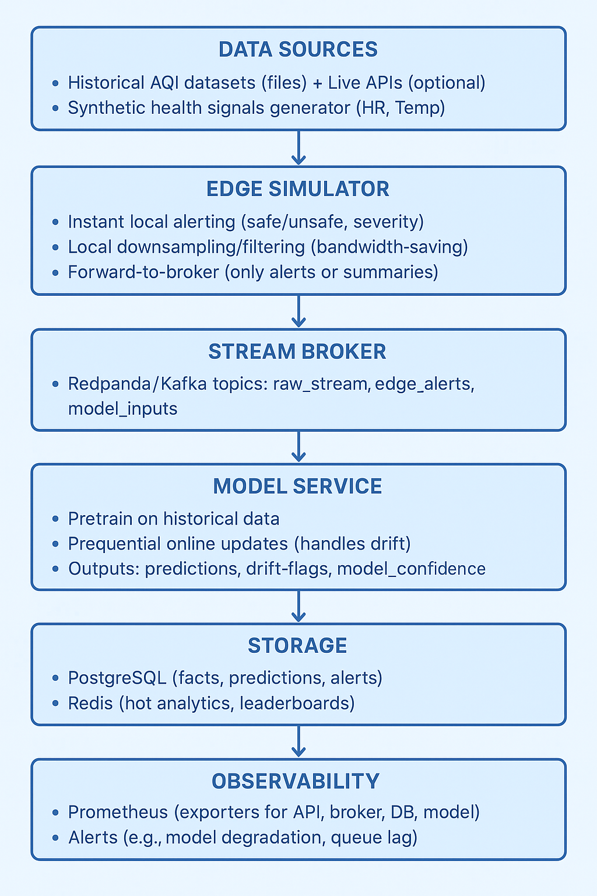

# Real-time Air Quality & Health Monitoring with EdgeFrame & Forgetful Forest

## Objective
The objective of this application is to evaluate the performance of a hybrid machine learning model combining **EdgeFrame (EF)** and **Forgetful Forest (FF)** for real-time health and air quality monitoring.  
The focus is on **performance evaluation** of the model in handling streaming data, concept drift, and adaptive learning using open health and environmental datasets.  

---

## Datasets
We will use publicly available datasets from the web for real-time health and air quality monitoring, such as:
- **UCI Machine Learning Repository – Air Quality Dataset**  
- **Kaggle – Real-time Health Monitoring & Air Quality Datasets**  
- **Government Open Data (e.g., data.gov / CPCB in India / US EPA)**  

These datasets include attributes such as **PM2.5, PM10, CO2, O3, NO2, SO2, Temperature, Humidity, Heart Rate, Respiration Rate, Blood Pressure**, etc.

---

## Existing Systems vs Proposed System
**Existing Systems**  
- Use static ML models for anomaly detection and forecasting.  
- Struggle with real-time adaptability and concept drift in data streams.  
- Limited visualization and monitoring dashboards.  

**Proposed Hybrid Model (EdgeFrame + Forgetful Forest)**  
- Adaptive and scalable model to handle **concept drift**.  
- Real-time evaluation of health and air quality risks.  
- Web-based performance visualization.  
- Monitoring and feedback loop for continuous model improvement.  

---

## System Architecture
The architecture integrates **data ingestion, preprocessing, hybrid ML model execution, monitoring, and visualization** in a modular way.  

---

## Modules of the Application
The application is divided into **six key modules**:

### 1. Web Interface (TypeScript + React)  ✅
- Provides a user-friendly dashboard.  
- Built using **TypeScript, React, and D3.js/Chart.js** for visualization.  
- Displays real-time air quality metrics and health predictions.  

### 2. Data Ingestion & Processing
- Streams real-time environmental and health data.  
- Cleans, normalizes, and handles missing values.  
- Prepares time-series data for EF & FF models.  

### 3. Hybrid Model Integration (EF + FF)
- Implements **EdgeFrame (EF)** for temporal-spatial streaming data structuring.  
- Integrates **Forgetful Forest (FF)** for adaptive learning under concept drift.  
- Ensures resilience against changing data distributions.  

### 4. Performance Monitoring
- Tracks latency, throughput, and resource usage of the hybrid model.  
- Implements real-time performance dashboards.  

### 5. Performance Evaluation
- Evaluates hybrid model on parameters such as:  
  - **Accuracy**  
  - **Precision / Recall / F1-Score**  
  - **Adaptability under drift**  
  - **Latency (ms)**  
  - **Resource efficiency (CPU, Memory)**  

### 6. Visualization & Reporting
- Displays real-time charts of model predictions and evaluation metrics.  
- Provides **comparative visualization of EF vs FF vs Hybrid EF+FF**.  
- Exports performance reports for research validation.  

---

## Parameters for Evaluation
- **Accuracy** – Correctness of predictions in real-time.  
- **Precision & Recall** – Reliability in detecting health/environment anomalies.  
- **F1-Score** – Balance between precision and recall.  
- **Latency** – Time taken for predictions in milliseconds.  
- **Scalability** – Model adaptability with increasing data size.  

---
